# BMP280 en ESP8266 (Wemos D1) con MicroPython y MQTT

## Aprende IoT

Esto es un tutorial con la información y herramientas necesarias para realizar un proyecto completo de Internet de las Cosas (IoT) basado en un microcontrolador ESP8266 y un sensor BMP280, capaz de medir variables ambientales como presión y temperatura y enviarlas a través de la red Wi-Fi. 

El dispositivo recoge los datos del sensor y los publica mediante el protocolo MQTT, uno de los sistemas de mensajería más utilizados en IoT, utilizando el estándar de la industria JSON para estructurar la información. El programa por bloques Node-RED, muy popular por su eficacia y facilidad de manejo, monitoriza la información en tiempo real creando atractivos paneles de visualización. 

El tutorial se diseñó para alumnado de 4º ESO. En nuestro caso el ESP8266 está integrado en una placa WeMos D1 R2 (tipo "Arduino").

## Qué harás

A lo largo de la práctica aprenderás a:

1. Preparar el ordenador con las herramientas necesarias.
2. Configurar automáticamente el ESP8266 con MicroPython.
3. Cargar en la placa el programa y las librerías del sensor BMP280.
4. Comprobar que todo funciona viendo los mensajes por REPL.
5. Enviar datos por MQTT.
6. Visualizar datos y controlar la placa desde Node-RED.

## Dónde está cada herramienta que te vamos a dar

- `firmware/` → aquí está el “sistema” que vamos a instalar en la placa.
- `lib/` → aquí están las librerías que necesita el programa para funcionar.
- `src/` → aquí está el programa principal que hemos creado para el ESP8266.

## 1) Hazte con los elementos que necesitas para trabajar

### 1.1) Empieza usando estos enlaces para descargar e instalar en tu ordenador los siguientes elementos:

- [Visual Studio Code](https://code.visualstudio.com/)
- [Driver **CH340** para el ESP8266](https://sparks.gogo.co.nz/ch340.html)  

**NOTA**: Si el aparece algún error al instalar el driver, instálalo de nuevo con la placa conectada al PC.

### 1.2) Descarga este repositorio

1. En la raíz del repositorio, darle al botón verde `<> Code`
2. Seleccionar `Download ZIP` 
   
3. En el directorio donde se ha descargado la carpeta comprimida (icono de carpeta con cremallera), haz doble clic en el icono y verás la misma carpeta sin cremallera. Para descomprimirla puedes arrastrarla a la carpeta que desees (por ejemplo a tu escritorio) o bien hacer clic derecho sobre ella y seleccionar extraer todo.


### 1.3) Abre la carpeta en la terminal

- En la carpeta ya descomprimida, hacer click derecho en un espacio en blanco y seleccionar `Abrir en Terminal`


- Comprueba que tienes Python instalado adecuadamente con este comando (cópialo y pégalo en la terminal): 

```powershell
py --version
```

Output esperado (ejemplo):

```text
Python 3.xx.x
```

- Si ya tienes Python instalado, salta el siguiente punto y ve directamente al apartado 2)

## 1.4) Instalar Python (para usar `py`)

1. Descarga e instala Python desde [python.org](https://www.python.org/).
2. Evita el install manager. Elige, en cambio, la última versión estable para Windows, que suele aparecer en la pantalla de bienvenida, como en la imagen:


3. **IMPORTANTE:** Observa la imagen y **asegúrate de marcar las casillas** siguientes al principio de la instalación:
   
   - “Install launcher for all users (recommended)”
   
   - “Add python.exe to PATH”
     
     

---

## 2) Abrir Visual Studio Code en la carpeta del repo

Vamos a abrir en Visual Studio Code, que es un software para programar, el directorio de este proyecto desde PowerShell con el siguiente comando:

```powershell
code .
```

(Observa el icono con dos recuadros superpuestos, arriba a la derecha. Hacer click en este icono te permite copiar el contenido del cuadro gris, en este caso, la URL) 

Cuando se abra Visual Studio Code, haz click en la opción por defecto: "Yes, I trust the authors” para habilitar todas las características. Ignora la pantalla de bienvenida central y dirígete al directorio a la izquierda. Allí, desplegamos la carpeta `src` y abrimos `app.py`. 


1. Tómate tu tiempo para leer el código.
2. En la sección “Config” tienes el nombre de la red (Línea 14: WIFI_SSID) y la contraseña (Línea 15: WIFI_PASS). Modificarlos por los valores de tu WiFi.
3. Ve a menú superior para guardar los cambios: “File” > “Save”

---

## 3) Cableado (Wemos D1 + BMP280 por I2C)

### Precauciones importantes para no destruir la placa WeMOS ni el sensor BMP 280

1) Manipula placa y sensor sujetándolos por sus bordes. Intenta no tocar partes internas incluso sin corriente (con la placa desconectada del ordenador).
2) Haz las conexiones entre placa y sensor BMP sin corriente.
3) Fíjate bien en la imagen de conexiones que aparece a continuación y asegúrate de que VCC esté conectado a 3.3V. Bajo ningún concepto uses 5V.
4) Antes de conectar la placa al ordenador, apoya placa y sensor en superficies aislantes como plástico o madera, nunca metal (si el cable es demasiado corto, dejarlos suspendidos del cable es aceptable).

En **Wemos D1**, los pines I2C más usados son:

- **D1 = SCL = GPIO5**
- **D2 = SDA = GPIO4**

SLC y SDA están serigrafiados en la placa compartiendo ubicación con D1 y D2. Puedes buscarlos en Google (Wemos D1 pinout) o fijarte en la siguiente imagen.

### Conexiones (I2C)


- Wemos **3V3** → BMP280 **VCC / VIN** (usa 3.3V)
- Wemos **G** (GND) → BMP280 **GND**
- Wemos **D1 (GPIO5 / SCL)** → BMP280 **SCL**
- Wemos **D2 (GPIO4 / SDA)** → BMP280 **SDA**

### Pines extra del BMP280 (si tu placa los tiene)

Muchos módulos BMP280 traen pines **CSB** y **SDO**:

- **CSB**: para I2C normalmente debe ir a **3V3** (en algunos módulos ya viene preparado, pero si no detecta el sensor, prueba a fijarlo a 3V3).
- **SDO**: selecciona la dirección I2C (típicamente `0x76` u `0x77`); a **GND** suele dar `0x76` y a **3V3** suele dar `0x77` (depende del módulo).

### Importante: niveles de tensión

Los pines del Wemos D1 mini son **3.3V** (no toleran 5V en señales).
Si tu módulo BMP280 es “solo 5V” o lleva pull-ups a 5V, no lo conectes directo (usa módulo 3V3 o adapta niveles).

---

## 4) Conectar tu placa WeMos al PC

Recuerda la precaución principal: antes de conectarla, apoya la placa y el sensor en superficies aislantes como plástico o madera, nunca metal (si el cable es demasiado corto, dejarlos suspendidos del cable es aceptable).

### Comprobar el puerto COM del ESP8266 y que el driver está instalado.

Esta comprobación te puede ahorrar quebraderos de cabeza después:

1) Pulsa Win + X (o haz clic derecho sobre el botón inicio) y elige **Administrador de dispositivos**


2) Abre el apartado **Puertos (COM y LTP)**. Verás algo como:
   
   ```
   “USB-SERIAL CH340 (COM3)”
   ```

“Silicon Labs CP210x USB to UART Bridge (COM5)”

“USB Serial Device (COM4)”

```


El número entre paréntesis es el puerto: **COM3, COM4, etc.**
Si no aparece nada:
- Desconéctalo y vuelve a conectarlo observando qué cambia.
- Puede faltar el driver (CH340 o CP210x según el chip USB que lleve tu placa).

**IMPORTANTE**:  Anota el número que te salga, por ejemplo, "COM6" (como se ve en la imagen de arriba), ya que lo utilizaremos al ejecutar los comandos para comunicarnos con nuesto ESP8266 y es necesario si decides configurar tu placa manualmente.


---

## 4) Configurar el ESP8266 de forma automática o semi-automática.

### 4.1) Método completamente automático (recomendado para esta práctica)

**Este es el método más fácil y recomendado para clase.** En lugar de escribir muchos comandos uno a uno, vamos a usar un script que hace todo automáticamente. 

Ten en cuenta que este método no abre la consola de MicroPython - REPL, de manera que no podrás probar comandos en tiempo real sobre la placa. Si quieres tener esa opción, lee 4.2

Si quieres elegir tú manualmente el puerto, lee 4.3

Si te gustan los retos y quieres entender el proceso paso a paso, puedes usar el **método manual** del apartado 5 de este tutorial.

#### ¿Qué hace este script?

El script `setup_esp8266.py` realiza estos pasos automáticamente:

1. Comprueba que las herramientas necesarias están instaladas.
2. Detecta y elige el puerto serie más probable de tu placa.
3. Borra la memoria flash del ESP8266.
4. Graba MicroPython en la placa.
5. Crea la carpeta `lib` dentro del ESP8266.
6. Compila `bmp280.py` y `app.py` a formato `.mpy`.
7. Sube `bmp280.mpy`, `main.py` y `app.mpy` al ESP8266.
8. Reinicia la placa al terminar.
9. Abre la terminal serie.

> En Windows usamos `py` porque es la forma recomendada de lanzar scripts y módulos de Python.

#### Ejecutamos el método completamente automático.

Desde la raíz del repositorio, dentro de la Terminal, ejecuta:

```powershell
py .\setup_esp8266.py --yes
```

#### Qué deberías ver si todo va bien.

Durante el proceso aparecerán mensajes parecidos a estos:

```text
[OK] esptool OK
[OK] mpremote OK
[OK] mpy-cross OK
[STEP] Borrando flash del ESP8266...
[STEP] Flasheando firmware MicroPython...
[STEP] Preparando sistema de ficheros en el ESP8266...
[STEP] Subiendo ficheros al ESP8266...
[TODO OK] Proceso completo.
```

#### Nota importante sobre símbolos "extraños" al reiniciar.

Al usar la **terminal serie**, es posible que al pulsar reset aparezcan durante un instante algunos caracteres extraños o “símbolos raros”.

**Esto es normal en ESP8266.**
Después del reinicio, enseguida deberían aparecer mensajes legibles del programa, por ejemplo:

```text
[boot] start
[wifi] connected
[i2c] scan: ...
```

#### Si algo falla

Prueba en este orden:

- Revisa que la placa esté bien conectada por USB.
- Cierra otras ventanas que estén usando el puerto serie.
- Ejecuta otra vez el mismo comando.
- Si el puerto recomendado no es correcto, usa `py .\setup_esp8266.py` y elígelo manualmente.
- Si sigue fallando, usa el **método manual** de los apartados siguientes.

#### Volver a abrir la consola más tarde

**Importante:** en los siguientes comandos, cambia `COM7` por el puerto real de tu placa que comprobaste en el paso 3.

Si ya terminaste el proceso y quieres volver a ver los mensajes después, puedes usar:

#### Abrir REPL

```powershell
py -m mpremote connect COM7 repl
```

#### Abrir terminal serie con el script

```powershell
py .\setup_esp8266.py --port COM7 --terminal serial --no-erase
```

Una vez terminada la autoconfiguración del ESP8266, el siguiente paso es ir al apartado [**6) Node‑RED: montar tu primer flow para ver y enviar datos**](#6-nodered-montar-tu-primer-flow-para-ver-y-enviar-datos), donde aprenderás a visualizar los datos del sensor en el servidor y a enviar órdenes a tu placa.

### 4.2) Si quieres otras opciones

Si no incluyes el modificador `--terminal repl`, al terminar el script permite elegir cómo ver los mensajes finales: con **REPL** o con **terminal serie**. Se ofrecerán tres opciones:


#### Opción 1: REPL

La **REPL** es la consola interactiva de MicroPython.
Sirve para escribir órdenes y probar cosas directamente en la placa.

Puedes abrirla directamente así:

```powershell
py .\setup_esp8266.py --yes --terminal repl
```

#### Opción 2: Terminal serie.

La **terminal serie** sirve para ver los mensajes de arranque y funcionamiento de la placa, como si fuera un monitor serie clásico.

Puedes abrirla así:

```powershell
py .\setup_esp8266.py --yes --terminal serial
```

**Ventaja:** esta opción suele ser mejor para ver logs, porque puede seguir abierta aunque reinicies la placa. Es la que sigue el método completamente automático en 4.1.

#### Opción 3: No abrir ninguna consola.

#### ¿Cuál conviene usar?

- Usa **REPL** si quieres escribir instrucciones de MicroPython a mano.
- Usa **terminal serie** si quieres ver mejor los mensajes del programa cuando la placa arranca o se reinicia.

### 4.3) Si quieres elegir el puerto manualmente

En la instación completamente automática usamos el modificador `--yes`. Esto significa que el script elegirá automáticamente el **puerto COM recomendado** si detecta uno claramente mejor que los demás.

Por ejemplo, si encuentra algo como esto:

```text
[RECOMENDADO] 1) COM6
   Descripcion : USB-SERIAL CH340 (COM6)
```

entonces seleccionará ese puerto sin preguntarte.

**Si, en cambio, quieres elegir tú el puerto, puedes usar este comando:**

```powershell
py .\setup_esp8266.py --terminal repl
```

Así el script te enseñará la lista de puertos y podrás escoger tú mismo.

**Si prefieres indicar directamente tu puerto COM**

En el paso 3 comprobaste tu puerto COM. Imagina que es `COM6`. En ese caso escribe:

```powershell
py .\setup_esp8266.py --port COM6
```

---

## 5) Método manual paso a paso para instalar MicroPython y subir el código.

Si has seguido un ainstalación automática o semi-atomática (apartado 4) salta este apartado y pasa el 6. 

### 5.1) Instala las herramientas necesarias.

vuelve a PowerShell y ejecuta estos comandos:

```powershell
py -m pip install --upgrade esptool
```

Qué hace: instala o actualiza `esptool`, que se usa para borrar la memoria flash y grabar MicroPython en el ESP8266.

```powershell
py -m pip install --upgrade mpremote
```

Qué hace: instala o actualiza `mpremote`, que se usa para copiar archivos al ESP8266 y abrir la consola REPL.

### 5.2) Borra la memoria flash (recomendado).

**IMPORTANTE**:  sustituye el número 7 en “COM7” en los siguientes comandos por el número del puerto COM al que acabas de comprobar que está conectado tu ESP8266.

```powershell
py -m esptool --chip esp8266 --port COM7 erase-flash
```

Qué hace: borra toda la flash del ESP8266.

Output esperado (aprox., puede variar):

```text
esptool.py v...
Serial port COM7
Connecting....
Chip is ESP8266
...
Erasing flash (this may take a while)...
Chip erase completed successfully in ...s
```

Si sale un error de configuración de puerto (como el que se ve en la imagen):


**[Requisitos previos](#requisitos-previos)** ← Reinstala CH341


### 5.3 "Flashear" el firmware del repo

```powershell
py -m esptool --chip esp8266 --port COM7 --baud 460800 write-flash --flash-size=detect 0x00000 ".\firmware\ESP8266_GENERIC-20251209-v1.27.0.bin"
```

Qué hace: escribe el `.bin` de `firmware/` en la dirección `0x00000` y autodetecta el tamaño de flash.

Output esperado (aprox., puede variar):

```text
esptool.py v...
Serial port COM7
Connecting....
Chip is ESP8266
...
Detected flash size: ...
Writing at 0x00000000... (xx %)
...
Hash of data verified.
Leaving...
Hard resetting via RTS pin...
```

### 5.4) Subir librerías y programa (mpremote) — modo “anti MemoryError”.

A veces el ESP8266 se queda sin memoria (RAM) justo al arrancar porque tiene que “leer y preparar” archivos `.py` grandes. Para evitar el **MemoryError**, hacemos esto: dejamos un `main.py` **muy pequeño o "stub"** (solo arranca el programa) y el programa “grande” lo subimos ya **precompilado** como `.mpy`, que ocupa menos RAM al cargar.

> Regla clave: en `mpremote`, los paths que empiezan por `:` son del ESP (remotos).

#### 5.4.1 Crear `/lib` en el ESP.

```powershell
py -m mpremote connect COM7 fs mkdir lib
```

Qué hace: crea la carpeta `lib` en el ESP para guardar drivers.

**NOTA**: Si te da algún error al lanzar este comando, prueba a lanzarlo de nuevo. Puede ser que haya habido un problema con la conexión al inicio. Un truco para volver a poner un comando es utilizar las flechas **ARRIBA** y **ABAJO** del teclado.

#### 5.4.2 Subir el driver BMP280 en `.mpy`, que ocupa menos memoria RAM.

0) Instalar mpy-cross en Windows

```powershell
py -m pip install --upgrade mpy-cross
```

1) Compilar el driver en el PC:
   
   ```powershell
   py -m mpy_cross .\lib\bmp280.py
   ```

2) Subir el `.mpy` al ESP:
   
   ```powershell
   py -m mpremote connect COM7 fs cp .\lib\bmp280.mpy :lib/bmp280.mpy
   ```

3) Verificar:
   
   ```powershell
   py -m mpremote connect COM7 fs ls :lib
   ```

Output esperado (ejemplo):

```text
bmp280.mpy
```

> Si prefieres no compilar el driver, puedes seguir subiendo `bmp280.py`, pero el riesgo de MemoryError es mayor.

#### 5.4.3 Preparar `app.py` (tu programa “grande”) y `main.py` (tu programa "pequeño").

En la carpeta del proyecto, dentro de `src` tenemos **dos archivos del PC** con funciones distintas. **No hay que modificar nada aquí**: solo entiende qué es cada uno y para qué sirve.

- `.\\src\\app.py`: es tu programa **completo** (el “largo”), donde está toda la lógica (WiFi, MQTT, sensor, etc.). Luego se compila a `app.mpy` para que el ESP8266 lo cargue con menos esfuerzo y menos uso de memoria.
- `.\\src\\main.py`: es un **stub** (un “arrancador” muy pequeño). Su única misión es ejecutarse al arrancar el ESP y hacer `import app` (cargar `app.mpy`). Al ser tan pequeño, evita el `MemoryError` que puede aparecer si el archivo principal es demasiado grande.

Contenido de `.\\src\\main.py` (stub):

```python
# main.py (stub mínimo)
try:
    import app  # app.mpy
except Exception as e:
    print("[boot] app import ERROR:", repr(e))
```

#### 5.4.4 Compilar `app.py` a `.mpy` en el PC.

```powershell
py -m mpy_cross .\src\app.py
```

Qué hace: crea `.\src\app.mpy`.

#### 5.4.5 Subir `main.py` (stub) y `app.mpy` al ESP.

1) Subir el stub `main.py` (esto hace que autoarranque):
   
   ```powershell
   py -m mpremote connect COM7 fs cp .\src\main.py :main.py
   ```

2) Subir el programa compilado:
   
   ```powershell
   py -m mpremote connect COM7 fs cp .\src\app.mpy :app.mpy
   ```

#### 5.4.6 Verificar archivos en la raíz del ESP.

```powershell
py -m mpremote connect COM7 fs ls
```

Output esperado (ejemplo):

```text
boot.py
lib/
main.py
app.mpy
```

### 5.5 Reset.

```powershell
py -m mpremote connect COM7 reset
```

Qué hace: reinicia el microcontrolador para que arranque con `main.py`, que a su vez carga `app.mpy`.

### 5.6 Abrir REPL

```powershell
py -m mpremote connect COM7 repl
```

Qué hace: abre la consola REPL para ver mensajes del arranque y depurar.

Dentro del REPL pulsa **Ctrl+D** para hacer “soft reboot” y ver otra vez el arranque con los logs.


En la pantalla se ve que tu placa (el ESP8266) está conectada al WiFi y empieza a funcionar: intenta buscar el sensor BMP280 por I2C `[i2c] scan: []` pero no encuentra nada y por eso da error al iniciarlo.

Luego se conecta al “correo” de mensajes (MQTT): se suscribe a un canal llamado activate_led (para recibir órdenes) y también a otro canal con su ID, y publica datos en otro canal `.../bmp280`.

**AVISO**: Es posible que salga un error de este tipo:

```
MPY: soft reboot
Traceback (most recent call last):
File "main.py", line 8, in <module>
MemoryError: memory allocation failed, allocating 376 bytes
MicroPython v1.27.0 on 2025-12-09; ESP module with ESP8266
Type "help()" for more information.
>>>
```

Si te da ese error, ve a **[Problema MemoryError](#problema-memoryerror-en-esp8266)** 

---

## 6) Node‑RED: montar tu primer flow para ver y enviar datos


Vas a usar bloques o ***nodos*** interconectados en un flujo o ***flow*** para:

1. Recibir los datos que envía tu ESP8266 por MQTT.
2. Comprobar que esos datos llegan bien.
3. Extraer solo la parte que nos interesa, por ejemplo la temperatura.
4. Mostrar esos datos en una página web llamada **Dashboard**.
5. Enviar órdenes al ESP8266, por ejemplo para encender o apagar un LED.

Piensa en Node‑RED como una cadena de montaje:


- Un nodo **recibe** los datos.
- Otro nodo los **muestra** para revisarlos.
- Otro nodo los **transforma**.
- Otro nodo los **enseña en pantalla**.
- Y otro nodo puede **enviar órdenes** de vuelta al ESP8266.

### 6.1 ¿Qué es Node‑RED?

Node‑RED es una herramienta visual para crear programas uniendo bloques llamados **nodos** con líneas.  
Cada nodo hace una tarea concreta, y al unir varios nodos construimos un **flow**, es decir, un flujo de trabajo.

Una forma sencilla de entenderlo es pensar en piezas de LEGO:

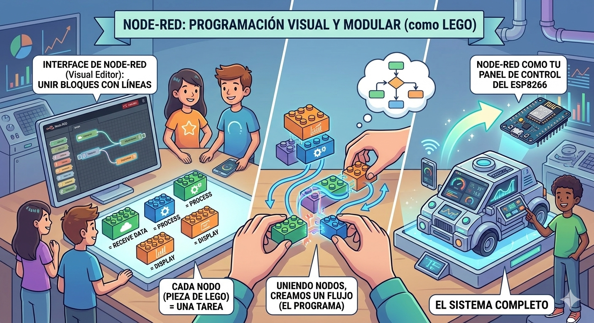

- Cada pieza hace algo.
- Tú decides en qué orden colocarlas.
- Al final, todas juntas forman un sistema completo.

En este proyecto, Node‑RED será nuestro **panel de control** del ESP8266.

### 6.2 Antes de empezar

Antes de abrir Node‑RED, comprueba lo siguiente:

- El ESP8266 ya tiene MicroPython instalado.
- El programa del ESP8266 ya está funcionando.
- La placa ya se conecta al WiFi.
- La placa ya está enviando datos por MQTT.

Para eso, abre la consola de MicroPython (punto 5.6). Si en la consola del ESP8266 ves mensajes parecidos a estos:

```text
[wifi] connected
[mqtt] publish OK
```

entonces ya puedes seguir con este apartado.

### 6.3 Qué es un flow

Un **flow** es un conjunto de nodos conectados entre sí.

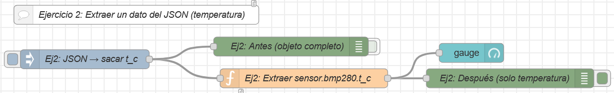

En esta práctica vamos a crear **dos flows**:

#### Flow 1: recibir y mostrar datos

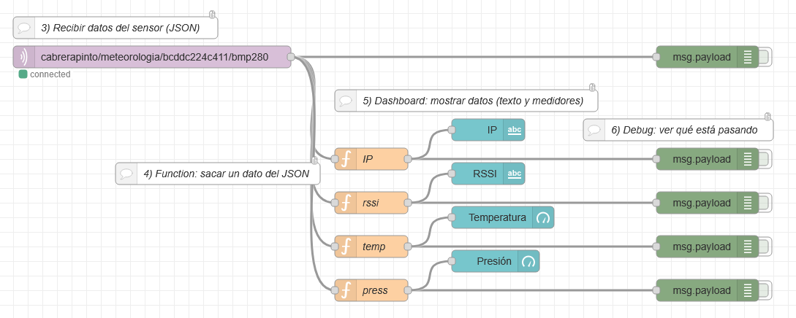

Este flow servirá para recibir los datos del sensor y mostrarlos en una dirección web.

```text
mqtt in  →  debug  →  function  →  ui_gauge / ui_text
```

#### Flow 2: enviar órdenes al ESP8266

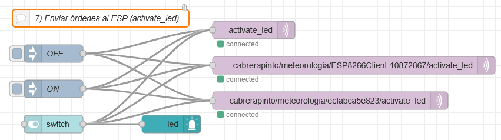

Este flow servirá para mandar órdenes desde Node‑RED a la placa.

```text
inject o ui_switch  →  mqtt out
```

### 6.4 Una pieza clave: MQTT


#### Qué es MQTT en esta práctica

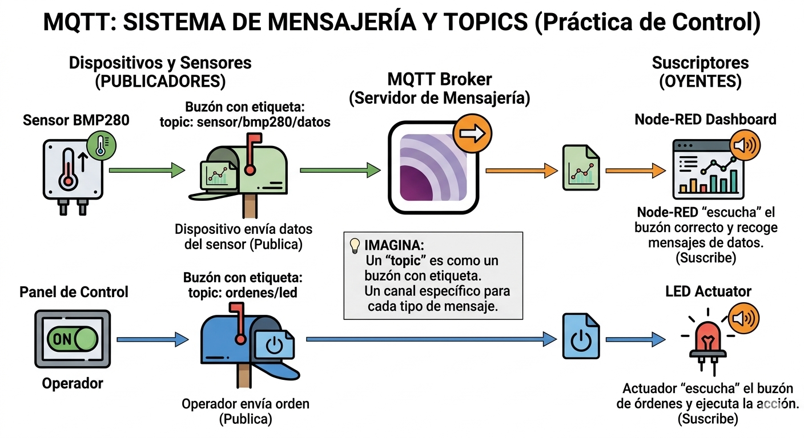

MQTT es un sistema de mensajería.

Los dispositivos envían y reciben mensajes usando “canales” llamados **topics**.

Por ejemplo:

- Un topic puede servir para enviar los datos del sensor.
- Otro topic distinto puede servir para enviar órdenes.

Cada topic es como un buzón:

- A un buzón de entrada llegan los datos del BMP280.
- De un buzón de salida salen órdenes para activar 0 desactivar algo (en este caso un LED).

Con Node‑RED puedes dirigirte al buzón indicado y recoger o dejar mensajes.

### 6.5 Abrir Node‑RED y reconocer la pantalla

Cuando abras Node‑RED verás tres zonas principales:

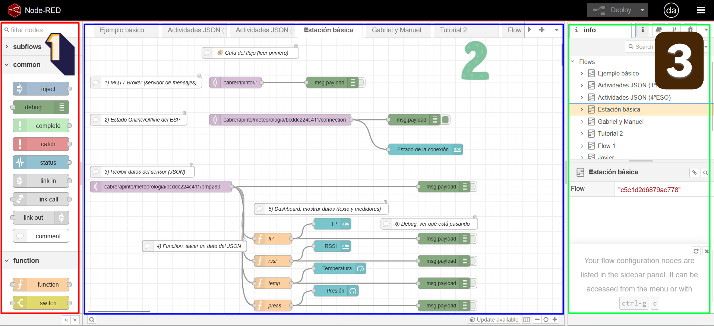

#### 1) Paleta de nodos

Suele estar en la parte izquierda.
Aquí aparecen los bloques que puedes arrastrar al espacio de trabajo.

Por ejemplo, verás nodos como:

- `inject`

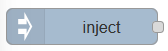

- `debug`


- `function`

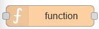

- `json`


- `mqtt in`

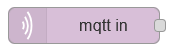

- `mqtt out`

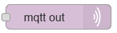

- `ui_text`

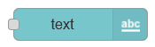

- `ui_gauge`


- `ui_switch`

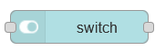


#### 2) Espacio de trabajo

Está en el centro.
Aquí es donde colocas los nodos y los conectas con líneas.

#### 3) Barra lateral derecha

Aquí aparecen varias pestañas con información y herramientas útiles.

La más importante al principio es la pestaña **Debug**, porque ahí verás los mensajes que recibe tu flow.  

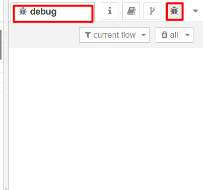

Esa pestaña te ayudará a comprobar si los datos están llegando bien desde MQTT y a entender qué contenido tiene `msg.payload`.

Más adelante también usarás otras zonas de la interfaz, como la del **Dashboard**, pero al principio lo más importante es aprender a mirar el panel **Debug** para revisar qué está pasando.

#### 4) Resumen rápido para empezar bien

Antes de arrastrar nodos, haz esto:

1. Abre Node‑RED.
2. Crea un flow nuevo con el botón **`+`**.

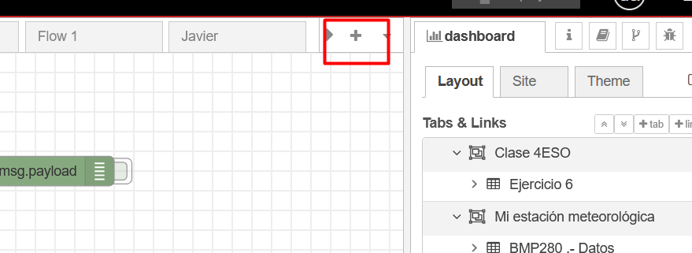

Cuando lo tengas, vamos a configurarlo:

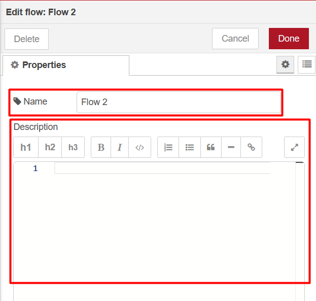

1. Ponle un **nombre** claro.
2. Añade una **descripción** breve.

A partir de aquí, empieza a construir el flow en el espacio central. Recuerda usar la pestaña **Debug** para comprobar que todo funciona.

De esta forma trabajarás de manera más ordenada y te resultará mucho más fácil entender qué hace cada parte del proyecto.

### 6.6 Primer objetivo: comprobar que llegan datos

Antes de construir paneles bonitos, medidores o botones, lo primero es comprobar que los datos **de verdad están llegando**.

Para eso vamos a crear el flow más simple posible:

```text
mqtt in  →  debug
```

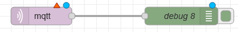

Este primer flow no transforma ni muestra nada en el Dashboard. Solo sirve para asegurarnos de que Node‑RED está recibiendo mensajes del ESP8266.

### 6.7 Primer nodo: `mqtt in`

Arrastra un nodo `mqtt in` al espacio de trabajo.

Ahora haz doble clic sobre él para configurarlo.

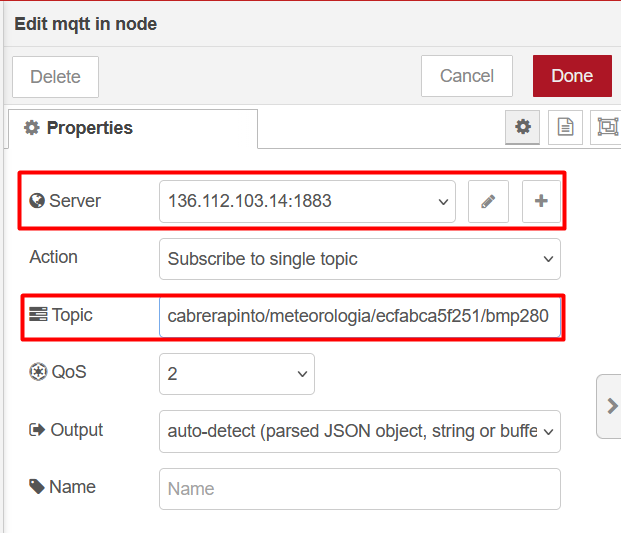

#### Qué debes configurar

##### A) Server

Aquí debes indicar el servidor MQTT, también llamado **broker**.

El broker es el “repartidor” de mensajes.
Si el broker no es correcto, Node‑RED no recibirá nada.

##### B) Topic

Aquí debes escribir el topic donde publica tu ESP8266.

Ejemplo:

```text
cabrerapinto/meteorologia/ecfabca5f251/bmp280
```

Cada placa o cada grupo puede tener un topic diferente, así que copia exactamente el tuyo.

#### Consejo útil

Si al principio no recuerdas el topic exacto, a veces puedes usar un topic más general con `#`, por ejemplo:

```text
cabrerapinto/#
```

Eso significa: “escucha cualquier subtopic que empiece por `cabrerapinto/`”.

**Pero cuidado:** eso está bien para pruebas, pero cuando ya funcione, lo mejor es usar el topic exacto de tu ESP8266 para no mezclar tus mensajes con los de otros compañeros.

### 6.8 Segundo nodo: `debug`

Ahora arrastra un nodo `debug` y conéctalo a la salida del nodo `mqtt in`.

El nodo `debug` sirve para mostrar en la barra lateral derecha el contenido de los mensajes que recibe.

Es muy parecido a usar `print()` en Python:

- no cambia el mensaje,
- no lo arregla,
- solo te enseña qué está pasando.

#### Qué debes hacer ahora

1. Conecta `mqtt in` con `debug`.
2. Pulsa el botón **Deploy** arriba a la derecha.

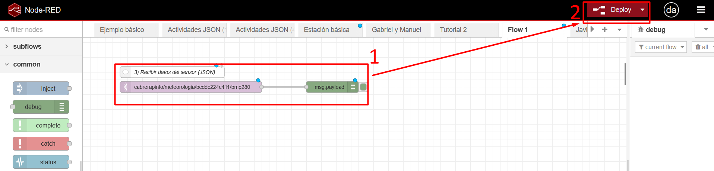

4. Mira la pestaña **Debug** en la barra lateral.

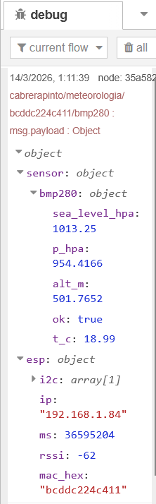

Si todo está bien, deberían empezar a aparecer mensajes.

**NOTA IMPORTANTE**: Cada vez que realicemos un cambio, tenemos que darle a **Deploy** para que todo funcione.

### 6.9 Qué aspecto puede tener el mensaje

Un mensaje típico puede ser parecido a este:

```json
{
  "esp": {
    "ip": "10.53.151.83",
    "rssi": -62
  },
  "sensor": {
    "bmp280": {
      "t_c": 22.45,
      "p_hpa": 1012.80
    }
  }
}
```

Vamos a entenderlo paso a paso.

#### Nivel 1: el mensaje completo

Tiene dos partes grandes:

- `esp`
- `sensor`

#### Nivel 2: la parte `esp`

Dentro de `esp` hay información sobre la placa, por ejemplo:

- `ip`
- `rssi`

#### Nivel 2: la parte `sensor`

Dentro de `sensor` hay otra parte llamada `bmp280`.

#### Nivel 3: la parte `bmp280`

Dentro de `bmp280` están los datos que nos interesan:

- `t_c` → temperatura en grados Celsius
- `p_hpa` → presión en hPa

### 6.10 Cómo leer el JSON sin perderse

Una forma fácil de entender el JSON es imaginar **cajas dentro de cajas**.

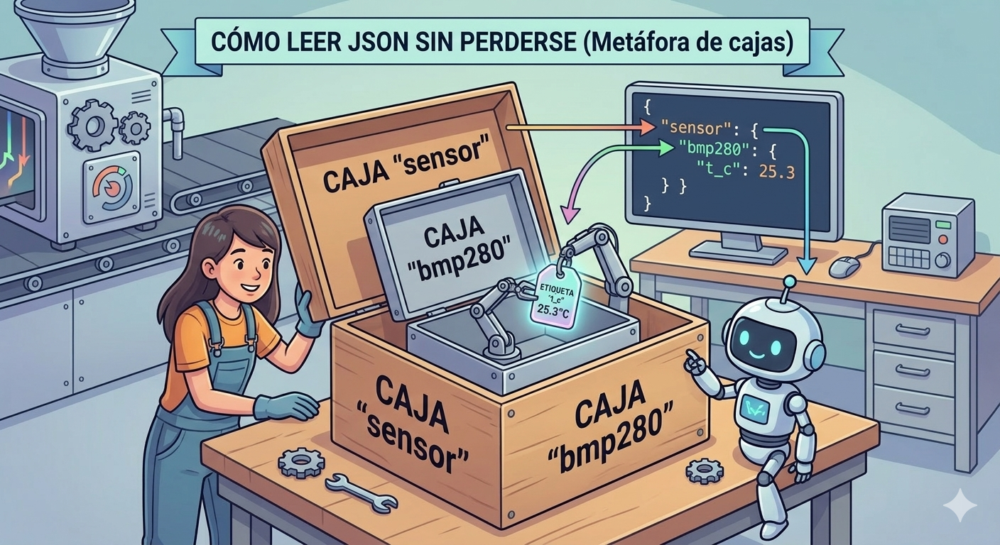

- Hay una caja grande llamada `sensor`.
- Dentro de esa caja hay otra caja llamada `bmp280`.
- Dentro de esa caja hay una etiqueta llamada `t_c`.

Por eso la ruta hasta la temperatura es:

```js
sensor.bmp280.t_c
```

Y como todo eso está dentro de `msg.payload`, en Node‑RED la ruta completa será:

```js
msg.payload.sensor.bmp280.t_c
```

### 6.11 Tercer nodo: `function` para extraer la temperatura

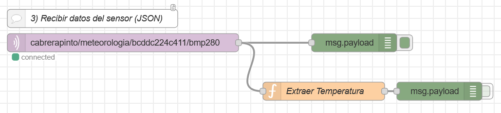


Ahora vamos a crear un nodo `function` para quedarnos solo con la temperatura.

#### Paso 1: arrastrar el nodo

Arrastra un nodo `function` al espacio de trabajo.

#### Paso 2: conectarlo

Conéctalo después del `mqtt in`.

Puedes dejar también el `debug` conectado en paralelo para seguir viendo el mensaje completo.

Por ejemplo:

```text
mqtt in ──→ debug
   │
   └──→ function
```

#### Paso 3: abrir la configuración

Haz doble clic sobre el nodo `function`.

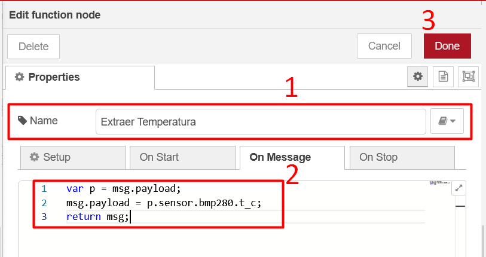

Ponle un nombre, por ejemplo:

```text
Extraer temperatura
```

#### Paso 4: escribir el código

Escribe este código:

```js
var p = msg.payload;
msg.payload = p.sensor.bmp280.t_c;
return msg;
```

Ahora vamos a entenderlo **línea por línea**.

### 6.12 Explicación línea por línea del código de temperatura

#### Línea 1

```js
var p = msg.payload;
```

Esta línea significa:

> “voy a guardar el contenido de `msg.payload` en una variable llamada `p`”.

¿Por qué hacemos esto?

Porque `msg.payload` es más largo de escribir.
Si lo guardamos en `p`, el código queda más limpio y más fácil de leer.

Es como si dijéramos:

> “a partir de ahora, llamaré `p` a todo este paquete de datos”.

#### Línea 2

```js
msg.payload = p.sensor.bmp280.t_c;
```

Esta es la línea más importante.

Lo que hace es:

1. entrar en `p`,
2. buscar la parte `sensor`,
3. luego la parte `bmp280`,
4. luego la etiqueta `t_c`,
5. y colocar ese valor como nuevo `msg.payload`.

Si la temperatura era `22.45`, entonces después de esta línea `msg.payload` ya no será el JSON completo, sino solo:

```text
22.45
```

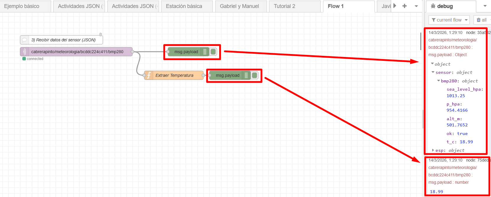

Es como si tuvieras una mochila llena de cosas y sacaras solo el **termómetro**, dejando lo demás aparte.

#### Línea 3

```js
return msg;
```

Esta línea significa:

> “ya he preparado el mensaje; ahora envíalo al siguiente nodo”.

Si olvidas esta línea, el mensaje no seguirá avanzando por el flow.

### 6.13 Qué hacer si aparece `undefined`

Si en vez de un número aparece `undefined`, significa que la ruta no coincide con el mensaje real.

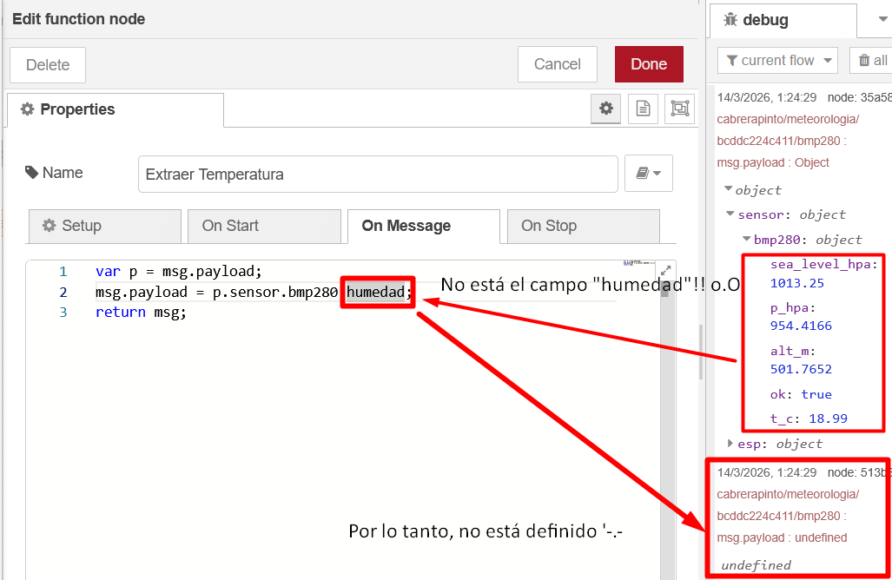

Puede pasar porque:

- el mensaje no trae `sensor`,
- o no trae `bmp280`,
- o el nombre es distinto,
- o estás intentando acceder a un campo que no existe.

En ese caso, vuelve al nodo `debug` y mira bien cómo llega el JSON.

**Regla de oro:**
primero mirar el `debug`, después escribir la ruta.

### 6.14 Y si el mensaje llega como texto

A veces el mensaje MQTT no llega como un objeto ya organizado, sino como texto.

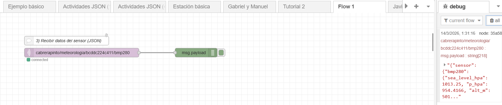

Por ejemplo, podrías ver algo así:

```text
"{\"sensor\":{\"bmp280\":{\"t_c\":22.45}}}"
```

Eso significa que el JSON está “metido en una cadena de texto”.

Si te pasa eso, añade un nodo `json` entre `mqtt in` y `function`:

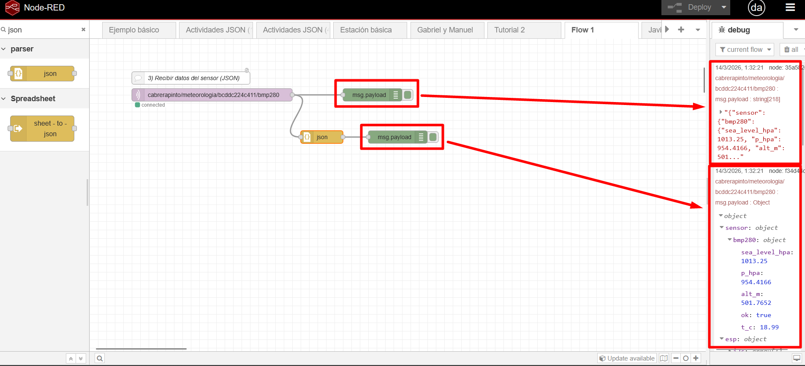

```text
mqtt in  →  json  →  function
```

El nodo `json` convierte ese texto en un objeto que ya se puede recorrer por dentro.

#### Cómo saber si necesitas el nodo `json`

Por defecto, el nodo `mqtt in` recibe los mensajes y los formatea a JSON. Aquí te van algunas pistas para ver si es necesario o no:

- Si en `debug` ves un árbol desplegable con campos, normalmente no hace falta.
- Si ves una sola línea llena de comillas y barras `\`, entonces sí conviene usarlo.

### 6.15 Cómo crear y organizar el Dashboard

El **Dashboard** es la página web donde verás los datos de forma visual.  
Ahí puedes colocar textos, medidores, interruptores, botones y otros elementos.

Para organizarlo todo, el Dashboard usa **tres niveles** que debes crear **en este orden**:

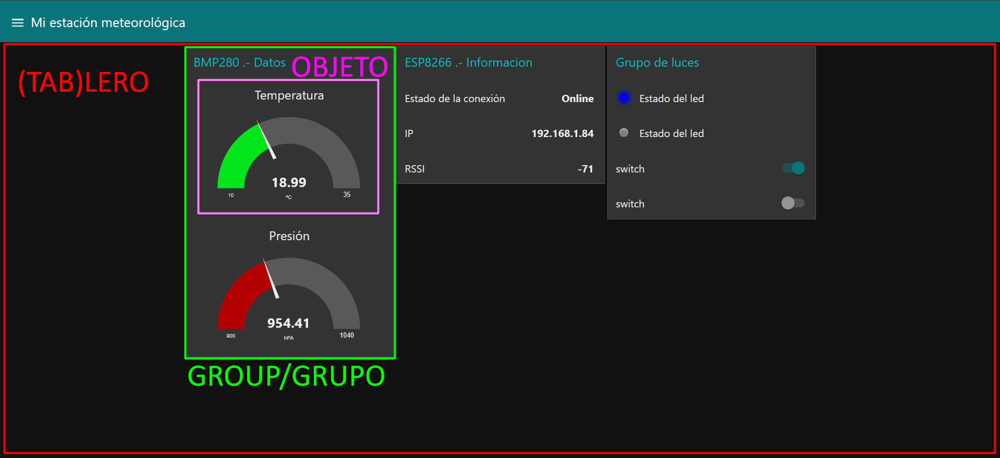

#### 1) Tab (Pestaña/Página)

Una **Tab** es como una pestaña de navegador. Cada Tab es una página distinta del Dashboard.

**Cómo crear una Tab:**

1. En Node‑RED, mira la **barra lateral derecha**.
2. Busca la pestaña **Dashboard** (icono de panel o monitor).

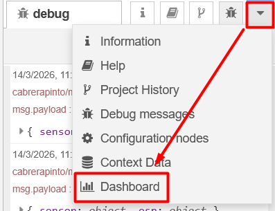

3. Pulsa el **+** junto a **"Tabs"**.

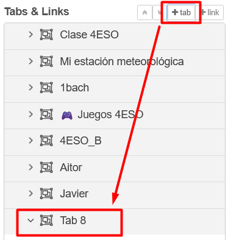

Vamos a configurar nuestro tablero:

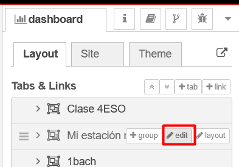

4. Escribe el nombre, por ejemplo: `Mi estación meteorológica`.

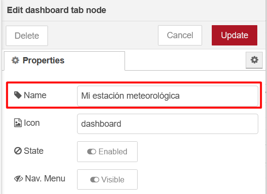

5. Pulsa **Update**.

**Ejemplos de Tabs útiles:**

- `Mi estación meteorológica` (página principal)
- `Sensores` 
- `Control`
- `Logs`

Para acceder a los tableros que se crean, en el Dashboard hay que darle click a las 3 lineas horizontales que hay en la esquina superior izquierda:

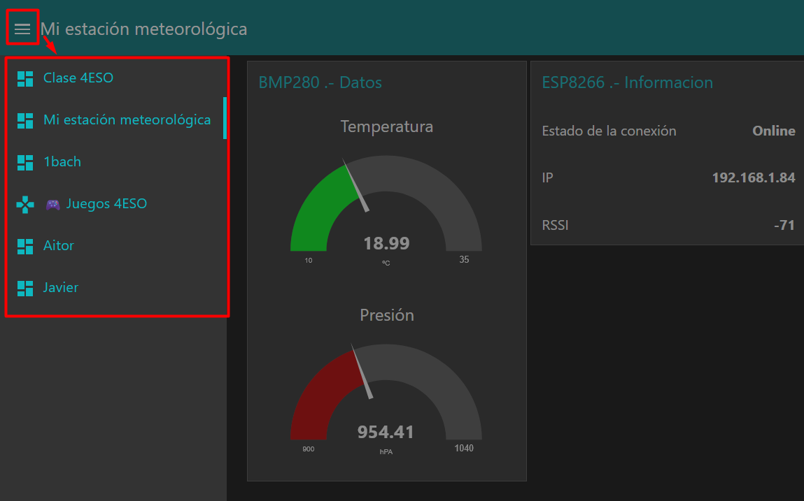

#### 2) Group (Caja/Sección)

Un **Group** es una caja o bloque **dentro** de una Tab. Sirve para agrupar widgets relacionados.

**Cómo crear un Group:**

1. En la misma pestaña **Dashboard** (barra lateral derecha).
2. Pulsa el **+ Group** junto a tu Tab `Mi estación meteorológica`.

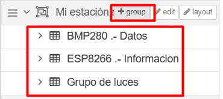

3. Escribe el nombre del grupo, por ejemplo: `Estado`.

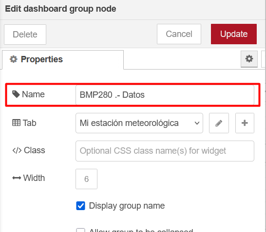

4. Selecciona el **With** (normalmente `col-6` o `col-12`). Esto es el ancho que quieres que ocupe tu grupo de objetos en el Dashboard.
5. Pulsa **Update**.

**Ejemplo de organización dentro de `ESP8266`:**

```
Tab: ESP8266
├── Group: Estado        ← IP, RSSI, Online/Offline
├── Group: BMP280       ← Temperatura, Presión
└── Group: Control LED  ← Interruptor del LED
```

#### 3) Widget (Elemento visual)

Un **Widget** es cada elemento que ves en la web: texto, medidor, botón, etc.

**Regla de oro: nunca asignes un widget sin antes tener Tab y Group.**

**Cómo configurar un widget (ejemplo con `ui_gauge`):**

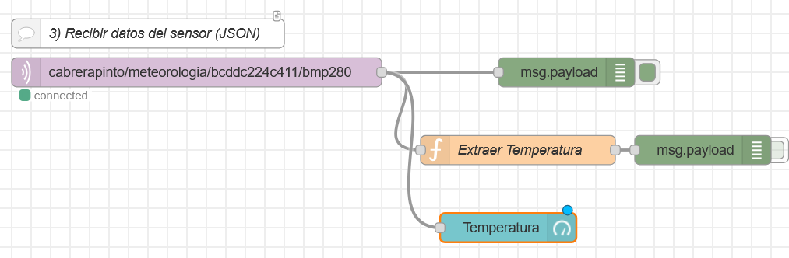

1. Arrastra `ui_gauge` al espacio de trabajo.

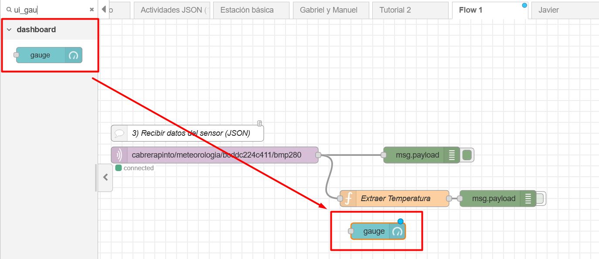

2. Haz **doble clic** sobre él.

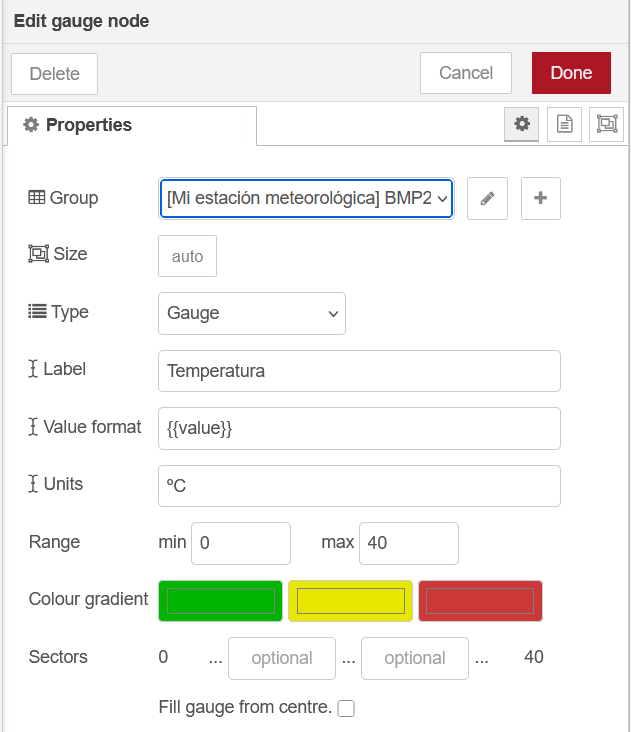

3. En **Group**, **selecciona** el grupo que creaste (ej: `BMP280`).
4. **Label**: `Temperatura`
5. **Units**: `ºC`
6. **Min**: `0` / **Max**: `50`
7. Pulsa **Done**.

#### **Orden correcto para no perderse**

```
1️⃣ Crear Tab → 2️⃣ Crear Group → 3️⃣ Configurar Widget
```

**Si haces esto al revés, el widget NO aparecerá.**

#### **Ejemplo práctico completo**

**Tu primera Tab y Groups:**

```
Tab: ESP8266
├── Group: Estado (col-6)
│   ├── ui_text: IP
│   └── ui_text: RSSI
├── Group: BMP280 (col-6)
│   ├── ui_gauge: Temperatura
│   └── ui_gauge: Presión
└── Group: Control (col-12)
└── ui_switch: LED
```

#### **Cómo ver el Dashboard**

1. **Deploy** los cambios.
2. En la barra lateral derecha, pestaña **Dashboard**.
3. Puedes darle al icono que tiene forma de cuadrado con una flecha saliendo.

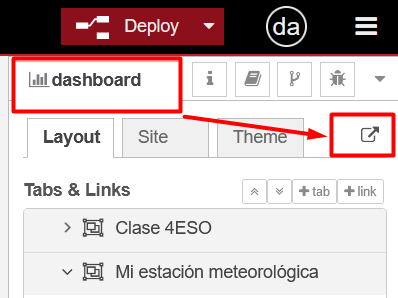

También puedes compiar la **URL** que aparece en Node-Red (algo como `http://[TU DIRECCIÓN IP]:1880/ui`).

4. Ábrela en una **pestaña nueva** del navegador.

#### **Errores típicos**

| Problema              | Solución                                             |
| --------------------- | ---------------------------------------------------- |
| **Widget no aparece** | No asignaste **Group** o el Group no tiene **Tab**   |
| **Todo en una línea** | Cambia el **layout** del Group a `col-6` o `col-12`  |
| **No se actualiza**   | Revisa que `msg.payload` sea un **número** (no JSON) |
| **URL no funciona**   | Comprueba que **Deploy** esté hecho                  |

#### **Consejo para clase**

**Crea siempre esta estructura base:**

```
Tab: ESP8266
├── Group: Estado
├── Group: Sensores
└── Group: Control
```

Y asigna **todos** tus widgets a uno de esos tres Groups. Así nunca te pierdes.

### 6.16 Mostrar la temperatura con `ui_gauge`

Una vez que el nodo `function` ya entrega solo un número, podemos mostrarlo en el Dashboard con un medidor.

Para eso vamos a usar el nodo `ui_gauge`.

#### Paso 1

Arrastra un nodo `ui_gauge`.

#### Paso 2

Conéctalo a la salida del nodo `function`.

#### Paso 3

Haz doble clic sobre él para configurarlo.

#### Paso 4

Configura estos campos:

- **Group**: el grupo donde aparecerá el medidor.
- **Label**: por ejemplo `Temperatura`.
- **Units**: por ejemplo `ºC`.
- **Min**: por ejemplo `0`.
- **Max**: por ejemplo `50`.

#### Qué debes entender

Este nodo necesita recibir un número.

Si le mandas un JSON completo, no sabrá qué hacer con él. Por eso antes usamos el nodo `function`: para dejar solo la temperatura.

### 6.17 Mostrar otros datos con `ui_text`

Además de la temperatura, a veces interesa enseñar datos como la IP o el RSSI.

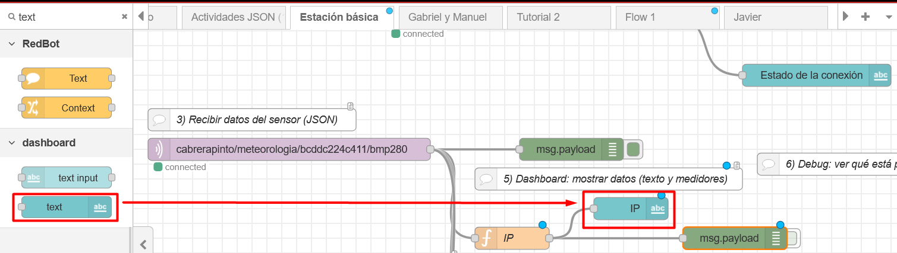

Para eso va muy bien `ui_text`.

#### Ejemplo: mostrar la IP

Primero crea un nodo `function` con este código:

```js
var p = msg.payload;
msg.payload = p.esp.ip;
return msg;
```

Luego conecta ese `function` a un nodo `ui_text`.

En `ui_text` puedes configurar:

- **Label**: `IP`
- **Format**:

```text
{{msg.payload}}
```

Así, en vez de ver un medidor, verás un texto en la web.

### 6.18 Extraer la presión

Ahora vamos a hacer exactamente lo mismo, pero con la presión.

Crea otro nodo `function` con este código:

```js
var p = msg.payload;
msg.payload = p.sensor.bmp280.p_hpa;
return msg;
```

La lógica es la misma que con la temperatura:

- entras en `sensor`,
- luego en `bmp280`,
- luego en `p_hpa`,
- y te quedas solo con la presión.

Después puedes conectarlo a otro `ui_gauge`.

#### Configuración sugerida del medidor de presión

- **Label**: `Presión`
- **Units**: `hPa`
- **Min**: `900`
- **Max**: `1100`

### 6.19 Montar el primer flow completo

Una versión sencilla del flow puede quedar así:


#### Para temperatura

```text
mqtt in  →  debug
   │
   └──→ function (temperatura)  →  ui_gauge
```

#### Para presión

```text
mqtt in  →  function (presión)  →  ui_gauge
```

#### Para IP

```text
mqtt in  →  function (ip)  →  ui_text
```

### 6.20 Organización recomendada del Dashboard

Para que no quede todo mezclado, puedes organizar el Dashboard así:

#### Tab

`Mi estación meteorológica`

#### Groups

- `Estado`
- `BMP280`
- `Control`

#### Dentro de `Estado`

- `ui_text` con la IP
- `ui_text` con el RSSI

#### Dentro de `BMP280`

- `ui_gauge` con la temperatura
- `ui_gauge` con la presión

#### Dentro de `Control`

- `ui_switch` para el LED

### 6.21 Ver el Dashboard

Cuando ya tengas los nodos colocados y configurados:

1. pulsa **Deploy**,
2. comprueba que los nodos MQTT aparecen como conectados,
3. abre la página del Dashboard.

Si todo está bien, deberías ver cómo los valores cambian conforme el ESP8266 va publicando datos.

### 6.22 Enviar órdenes al ESP8266

Una vez que ya sabes recibir datos, vamos a mandar una orden.

Para eso haremos un flow muy sencillo.

### 6.23 Opción A: usar `inject`

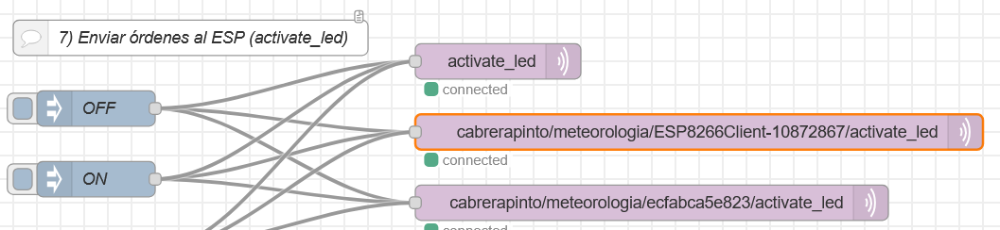

El nodo `inject` sirve para lanzar un mensaje manualmente.

Es como un botón de prueba.

#### Qué debes hacer

1. Arrastra un nodo `inject`.
2. Haz doble clic sobre él.

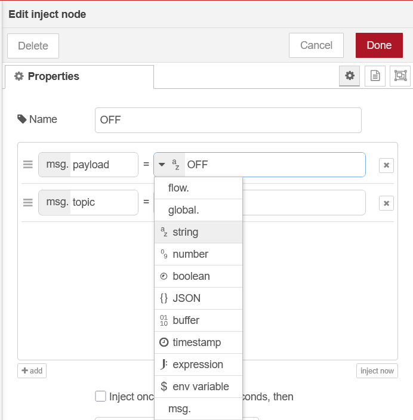

3. Configura el valor como `true` o `false`, según lo que espere tu programa.
4. Arrastra un nodo `mqtt out`.
5. Conecta `inject` con `mqtt out`.

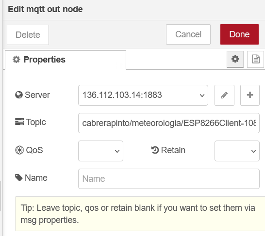

7. En `mqtt out`, selecciona el Server correcto.
8. Escribe el topic de control del ESP8266.
9. Pulsa **Deploy**.

Ahora, cada vez que pulses el botón del nodo `inject`, estarás enviando una orden MQTT.

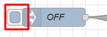

### 6.24 Opción B: usar `ui_switch`

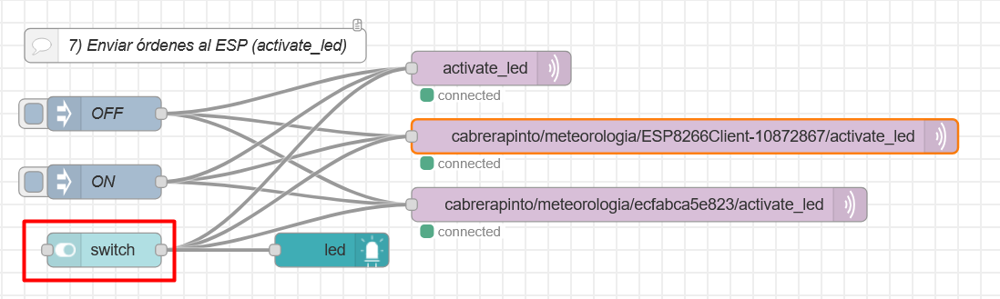

Si quieres controlar la placa desde el Dashboard, usa `ui_switch`.

#### Qué debes hacer

1. Arrastra un nodo `ui_switch`.

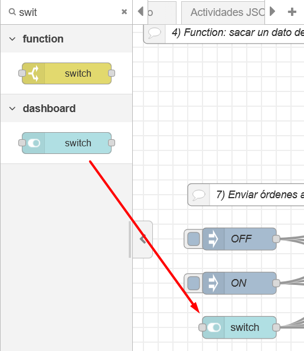

2. Asígnalo a una **Tab** y un **Group**.

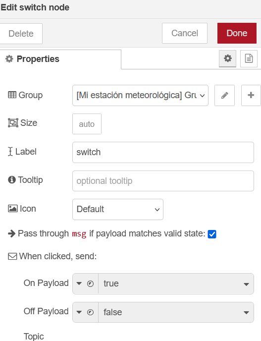

3. Indicale qué tipo de datos quieres que envíe cuando lo pulses.
4. Conéctalo a un nodo `mqtt out`.
5. Configura `mqtt out` con el topic de control correcto.
6. Pulsa **Deploy**.

Ahora verás un interruptor en la web.

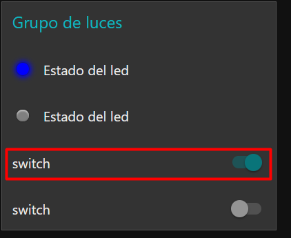

Cuando lo cambies, Node‑RED enviará una orden al ESP8266.

### 6.25 Cómo revisar un flow sin perderse

Si algo no funciona, sigue siempre este orden:

1. **`mqtt in`**: comprueba que el broker y el topic están bien.
2. **`debug`**: mira si realmente llegan mensajes.
3. **`json`**: comprueba si hace falta convertir texto a objeto.
4. **`function`**: revisa si la ruta del dato es correcta.
5. **`ui_*`**: comprueba si el widget recibe el tipo de dato correcto.
6. **Dashboard**: revisa que Tab y Group estén bien asignados.

### 6.26 Errores típicos

#### No llega nada al `debug`

Revisa:

- el broker,
- el topic,
- y que el ESP8266 esté publicando datos.

#### Sale `undefined`

La ruta del dato es incorrecta.
Vuelve al `debug` y revisa la estructura del JSON.

#### El widget no aparece

Seguramente no has seleccionado bien la **Tab** o el **Group**.

#### El medidor no funciona

Probablemente no está recibiendo un número, sino un JSON completo o un texto.

#### No se enciende ni apaga el LED

Revisa el topic del `mqtt out` y el tipo de dato que estás enviando.

### 6.27 Objetivo final

Al terminar este apartado deberías tener:

- un flow que reciba los datos del ESP8266,
- un nodo `debug` para inspeccionarlos,
- uno o varios nodos `function` para extraer valores,
- un Dashboard con textos y medidores,
- y un control para enviar órdenes desde Node‑RED al ESP8266.

Si has llegado hasta aquí, ya has montado tu **primer sistema IoT visual**:
tu placa mide, publica, Node‑RED recibe, procesa y muestra los datos, y además puede enviar órdenes de vuelta.

---

## Problemas típicos

- “No such file or directory” al flashear: revisa que estás en la raíz del repo y que exista `.\firmware\ESP8266_GENERIC-20251209-v1.27.0.bin`.

- Puerto COM incorrecto: repite el comando de WMI y cambia `COM7`.

- Puerto ocupado: cierra otros monitores serie antes de `mpremote repl`.

- Problemas con el driver CH340. Para poder utilizar el ESP8266 en la placa Wemos D1 (y familia), es necesario instalar el siguiente driver para Windows:
  
  ```
  https://sparks.gogo.co.nz/ch340.html?srsltid=AfmBOor7tyDgtSqSAO0hgxhvOsTXVapHI-UHmGEhj92JIU62x5SokqCV
  ```

- Si a lo largo del proceso fuera necesario realizar operaciones con nivel de ***ADMINISTRADOR***, dentro de la terminal, jecutamos el siguiente comando:
  
  ```
  $dir = $PWD.Path; Start-Process powershell -ArgumentList "-NoExit", "-Command", "Set-Location '$dir'" -Verb RunAs
  ```

- Hay que asegurarnos de que tenemos la ruta con las variables de entorno que vamos a utilizar. Esto nos permite utilizar en la ventana de comandos las funciones que utilizan `esptool` y `mpremote` para flashear ESP8266 en clase. Copia el siguiente comando en la terminal que has abierto con permisos de administrador:

```powershell
setx /M PATH "%PATH%;C:\Users\u_38002831\AppData\Local\Programs\Python\Python314\Scripts"
```

- Si has subido antes el bmp280.py, ejecuta el siguiente comando, si te interesara borrarlo por aumentar espacio:

Borrar el `bmp280.py` del ESP, si existe (importante: si existe, “gana” al `.mpy`):

```powershell
py -m mpremote connect COM7 fs rm :lib/bmp280.py
```

- Si has subido antes el app.py, ejecuta el siguiente comando, si te interesara borrarlo por aumentar espacio:

Borrar `app.py` del ESP, si existía (muy importante):

```powershell
py -m mpremote connect COM7 fs rm :app.py
```

## Problema MemoryError en ESP8266

En ESP8266 es posible ver errores como:
`MemoryError: memory allocation failed, allocating ... bytes` al arrancar/importar módulos.

Una solución recomendada es **precompilar** módulos `.py` a `.mpy` con `mpy-cross` y copiar el `.mpy` al ESP.
Importante: borra el `.py` del ESP si subes el `.mpy`, porque el `.py` puede tener prioridad sobre el `.mpy` al importar.

### A) Instalar mpy-cross en Windows

```powershell
py -m pip install --upgrade mpy-cross
```

### B) Compilar el driver BMP280 del repo

Desde la raíz del repo:

```powershell
py -m mpy_cross .\lib\bmp280.py
```

Esto genera:

- `.\lib\bmp280.mpy`

### C) Copiar bmp280.mpy al ESP y borrar bmp280.py del ESP

```powershell
py -m mpremote connect COM7 fs cp .\lib\bmp280.mpy :lib/bmp280.mpy
py -m mpremote connect COM7 fs rm :lib/bmp280.py
```

### D) Reset y comprobar

```powershell
py -m mpremote connect COM7 reset
py -m mpremote connect COM7 repl
```

Dentro del REPL pulsa **Ctrl+D** para ver el arranque y comprobar que ya no aparece el MemoryError.

---

---
